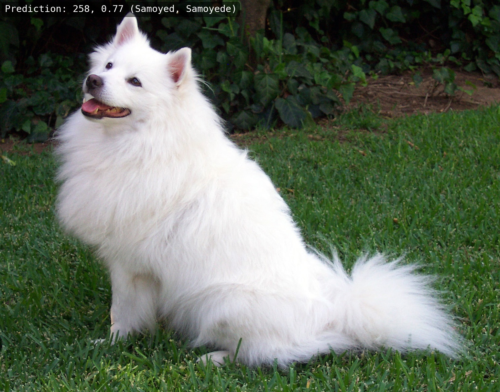
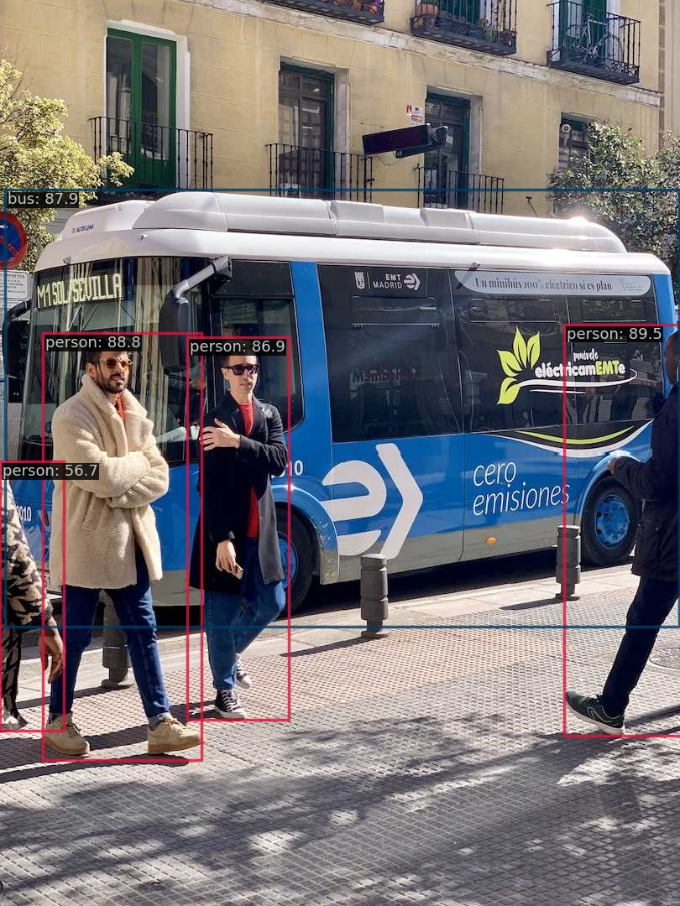
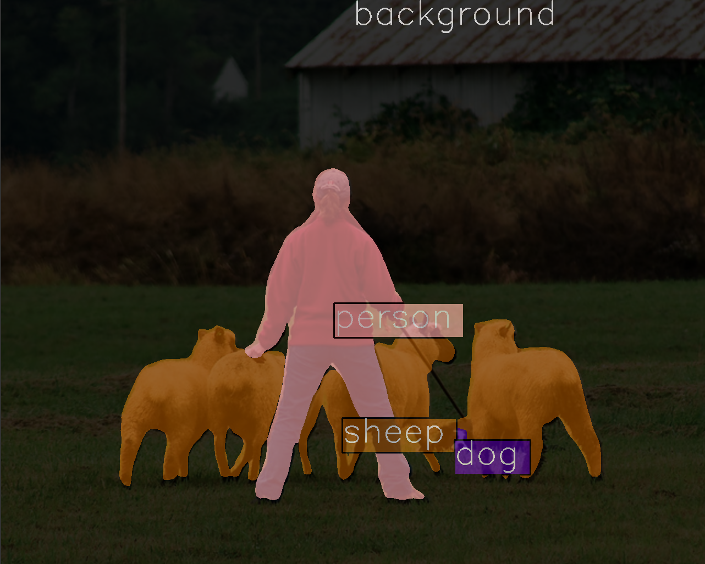

<div align="center">

# DLICV: Deep Learning Inference kit tool for Computer Vision


</div>


## 简介
DLICV是一个基于PyTorch开发，用于在计算机视觉任务中进行深度学习推理的python库。针对不同的硬件平台和推理后端，它供了深度学习模型推理的统一接口，屏蔽了不同推理后端的诸多使用细节诸如资源申请释放、数据搬运等。DLICV将常见计算机视觉基础任务的深度学习推理过程抽象为数据前处理、后端模型推理、预测结果后处理和推理结果可视化，并将上述流程封装在基础预测器中实现端到端的推理过程，避免重复编写繁琐的推理脚本。上述特性使得DLICV可以在不同平台上针对不同任务提供一致和便捷的深度学习模型推理体验。
## 主要特性
### 支持多种硬件平台和推理后端
支持的硬件平台和推理后端如下表所示
The supported Device-InferenceBackend matrix is presented as following,

| Device / <br> Inference Backend | [ONNX Runtime](https://github.com/microsoft/onnxruntime) | [TensorRT](https://github.com/NVIDIA/TensorRT) | [OpenVINO](https://github.com/openvinotoolkit/openvino) | [ncnn](https://github.com/Tencent/ncnn) | [CANN](https://www.hiascend.com/software/cann) | [CoreML](https://github.com/apple/coremltools) |
| :-----------------------------: | :------------------------------------------------------: | :--------------------------------------------: | :-----------------------------------------------------: | :-------------------------------------: | :--------------------------------------------: | :--------------------------------------------: |
|           X86_64 CPU            |                            ✅                             |                                                |                            ✅                            |                                         |                                                |                                                |
|             ARM CPU             |                            ✅                             |                                                |                                                         |                    ✅                    |                                                |                                                |
|             RISC-V              |                                                          |                                                |                                                         |                    ✅                    |                                                |                                                |
|           NVIDIA GPU            |                            ✅                             |                       ✅                        |                                                         |                                         |                                                |                                                |
|          NVIDIA Jetson          |                                                          |                       ✅                        |                                                         |                                         |                                                |                                                |
|          Huawei ascend          |                                                          |                                                |                                                         |                                         |                       ✅                        |                                                |
|            Apple M1             |                                                          |                                                |                                                         |                    ✅                    |                                                |                       ✅                        |


### 端到端的推理流程

DLICV实现的`BasePredictor`提供了端到端的推理体验，它将常见的计算机视觉基础任务中的深度学习推理过程分解为四个核心环节：数据预处理、后端模型推理、预测结果后处理和推理结果可视化。通过将这四个环节整合到一个基础预测器中，DLICV避免了开发者需要重复编写复杂且繁琐的推理脚本，从而提高开发效率。

### 提供同时支持`np.ndarry`和`torch.Tenosr`的多种常用的图像、边界框处理函数
- [图像处理](): `imresize`, `impad`, `imcrop`, `imrotate`
- [图像变换](): `LoadImage`, `Resize`, `Pad`, `ImgToTensor`
- [边界框处理](): `clip_boxes`, `resize_boxes`, `box_iou`, `batched_nms`

## 安装
安装DLICV和基础依赖包
```bash
pip install git+https://github.com/xueqing888/dlicv.git
```
<details open>
<summary>为了实现多平台推理，需要安装相应推理后端及所提供的Python SDK</summary>

|    名称     | 安装说明                                                     |
| :---------: | :----------------------------------------------------------- |
| ONNXRuntime | [ONNX Runtime官方文档](https://onnxruntime.ai/docs/get-started/with-python.html#install-onnx-runtime)中提供了GPU和CPU两个版本的Python包安装方式。在任何一个环境中，一次只能安装其中一个包。<br />如果你的平台上有支持CUDA的GPU硬件，推荐GPU版本的安装包，它同时包含了绝大部分CPU版本的功能<br /><pre> `pip install onnxruntime-gpu`</pre>如果要在ARM CPU或者macOS上运行，请安装CPU版本的Python包<br /><pre>`pip install onnxruntime`</pre> |
|  TensorRT   | 首先确认你的平台上安装有合适的CUDA 版本的GPU驱动，可以通过`nivdia-smi`指令查看。<br />然后可以通过安装[TensorRT官方](https://github.com/NVIDIA/TensorRT?tab=readme-ov-file#prebuilt-tensorrt-python-package)提供的预编译Python包来安装TensorRT<br /><pre>`pip install tensorrt`</pre> |
|  OpenVINO   | 安装 [OpenVINO](https://docs.openvino.ai/2021.4/get_started.html)<br /><pre>`pip install openvino-dev`</pre> |
|    ncnn     | 1. 请参考 ncnn的 <a href="https://github.com/Tencent/ncnn/wiki/how-to-build">wiki</a> 编译 ncnn。编译时，请打开<code>-DNCNN_PYTHON=ON</code><br/>2. 将 ncnn 的根目录写入环境变量<br/><pre>`cd ncnn`<br />`export NCNN_DIR=$(pwd)`</pre>3. 安装 pyncnn<br><pre>`cd ${NCNN_DIR}/python`<br/>`pip install -e .`</pre> |
|   Ascend    | 1. 按照[官方指引](https://www.hiascend.com/document/detail/zh/CANNCommunityEdition/60RC1alpha02/softwareinstall/instg/atlasdeploy_03_0002.html)安装 CANN 工具集.<br/>2. 配置环境<br/>   <pre>`export ASCEND_TOOLKIT_HOME="/usr/local/Ascend/ascend-toolkit/latest"`</pre> |

</details>

## 快速上手

<details open>
<summary>后端模型推理</summary>

DLICV实现的`BackendModel`支持多种推理后端模型的推理。使用起来也非常简单，传入相应的后端模型文件、设备类型（可选）等参数构建一个可调用**后端模型**对象。传入`torch.Tensor`数据就可进行推理，获取推理结果。

```python
import dlicv
import torch
from dlicv import BackendModel

X = torch.randn(1, 3, 224, 224)

onnx_file = '/path/to/onnx_model.onnx'
onnx_model = BackendModel(onnx_file)
onnx_preds = onnx_model(X, force_cast=True)

trt_file = '/path/to/tensorrt_model.trt'
trt_model = BackendModel(trt_file)
trt_pred = trt_model(X, force_cast=True)
```

</details>

<details open>
<summary>使用<code>BaseClassifier</code>实现图像识别任务的端到端推理</summary>

以[Resnet18](https://pytorch.org/vision/stable/models/resnet.html#resnet)的推理为例介绍`BaseClassifier`的使用

```python
import urllib.request

import dlicv
import torch
from dlicv import BaseClassifier
from dlicv.transform import *
from torchvision.models.resnet import resnet18, ResNet18_Weights

# Download an example image from the pytorch website
url, filename = ("https://github.com/pytorch/hub/raw/master/images/dog.jpg", "dog.jpg")
urllib.request.urlretrieve(url, filename)

# Build resnet18 with ImageNet 1k pretrained weights from torchvison.
model = resnet18(weights=ResNet18_Weights.IMAGENET1K_V1)
model.eval().cuda()

# Build data pipeline for image preprocessing with `dlicv.transforms`
MEAN = [123.675, 116.28, 103.53]
STD = [58.395, 57.12, 57.375]
data_pipeline = Compose([
   LoadImage(channel_order='rgb', to_tensor=True, device='cuda'),
   Resize(224),
   Pad(to_square=True, pad_val=114),
   Normalize(mean=MEAN, std=STD),
])

# Build Classifier
classifier = BaseClassifier(model, data_pipeline, classes='imagenet')
res = classifier(filename, show_dir='./') # 
```
成功运行上述代码后会在当前工作目录下生成`vis`目录，该目录下有一张名为`dog.jpg`的可视化结果图像如下所示

<div align="center">

<p></p>
</div>

</details>

<details open>
<summary>使用<code>BaseDetector</code>实现目标检测任务的端到端推理</summary>

以目标检测模型[YOLOv8](https://github.com/ultralytics/ultralytics)的推理为例介绍`BaseDetector`的使用</br>可以参考`YOLOv8`官方的[模型导出教程](https://docs.ultralytics.com/modes/export)来获取你想要的后端模型，这里我们以yolov8n的onnx模型推理为例

```python
import urllib.resuest

import torch
from dlicv import BackendModel, BaseClassifier
from dlicv.transform import *

# Download an example image from the ultralytics website
url, filename = ("https://ultralytics.com/images/bus.jpg", "bus.jpg")
urllib.request.urlretrieve(url, filename)

# Build BackendModel.
backend_model_file = '/path/to/onnx-model/yolov8n.onnx'
backend_model = BackendModel(backend_model_file)

# Build data pipeline for image preprocessing with `dlicv.transforms`
data_pipeline = (
    LoadImage(channel_order='rgb'),
    Resize((640, 640)),
    Normalize(mean=0, std=255),
    ImgToTensor()
)

# Build detector by subclassing `BaseDetector`, and implement the abstract
# method `_parse_preds` to parse the predictions from backend model into 
# bbox results
class YOLOv8(BaseDetector):
    def _parse_preds(self, preds: torch.Tensor, *args, **kargs) -> tuple:
        scores, boxes, labels = [], [], []
        outputs = preds.permute(0, 2, 1)
        for output in outputs:
            classes_scores = output[:, 4:]
            cls_scores, cls_labels = classes_scores.max(-1)
            scores.append(cls_scores)
            labels.append(cls_labels)

            x, y, w, h = output[:, 0], output[:, 1], output[:, 2], output[:, 3]
            x1, y1 = x - w / 2, y - h / 2
            x2, y2 = x + w / 2, y + h / 2
            boxes.append(torch.stack([x1, y1, x2, y2], 1))
        return boxes, scores, labels

# Init Detector
detector = YOLOv8(backend_model, 
                  data_pipeline, 
                  conf=0.5,
                  nms_cfg=dict(iou_thres=0.5, class_agnostic=True),
                  classes='coco')
res = detector(filename, show_dir='.') 
```
成功运行上述代码后会在当前工作目录下生成`vis`目录，该目录下有一张名为`bus.jpg`的可视化结果图像如下所示

<div align="center">

<p></p>
</div>

</details>

<details open>
<summary>使用<code>BaseSegmentor</code>实现语义分割任务的端到端推理</summary>

以语义分割模型[DeepLabV3](https://pytorch.org/vision/stable/models/deeplabv3.html#deeplabv3)的推理为例介绍`BaseSegmentor`的使用

```python
import urllib.request
from torchvision.models.segmentation import deeplabv3_resnet101, DeepLabV3_ResNet101_Weights

from dlicv.predictor import BaseSegmentor
from dlicv.transforms import *

# Download an example image from the pytorch website
url, filename = ("https://github.com/pytorch/hub/raw/master/images/deeplab1.png", "deeplab1.png")
urllib.request.urlretrieve(url, filename)

# Build DeepLabv3 with pretrained weights from torchvison.
model = deeplabv3_resnet101(weights=DeepLabV3_ResNet101_Weights)
model.eval().cuda()

# Build data pipeline for image preprocessing with `dlicv.transforms`
MEAN = [123.675, 116.28, 103.53]
STD = [58.395, 57.12, 57.375]
data_pipeline = Compose([
   LoadImage(channel_order='rgb', to_tensor=True, device='cuda'),
   Normalize(mean=MEAN, std=STD),
])

# Build segmentor by subclassing `BaseSegmentor`, and rewrite the 
# method `postprocess`
class DeepLabv3(BaseSegmentor):
    def postprocess(self, preds, *args, **kwargs):
        pred_seg_maps = preds['out']
        return super().postprocess(pred_seg_maps, *args, ** kwargs)

segmentor = DeepLabv3(model, data_pipeline, classes='voc_seg')
res = segmentor(filename, show_dir='./')
```
成功运行上述代码后会在当前工作目录下生成`vis`目录，该目录下有一张名为`deeplab1.png`的可视化结果图像如下所示

<div align="center">

<p></p>
</div>

</details>

## 开源许可证
该项目采用 [Apache 2.0](LICENSE) 开源许可协证
## 致谢
- [MMEngine](https://github.com/open-mmlab/mmengine): OpenMMLab foundational library for training deep learning models.
- [MMCV](https://github.com/open-mmlab/mmcv): OpenMMLab foundational library for computer vision.
- [MMDeploy](https://github.com/open-mmlab/mmdeploy): OpenMMLab model deployment framework.
## 引用
如果您在研究中使用了本项目的代码，请参考如下 bibtex 引用 DLICV:

```BibTeX
@misc{=dlicv,
    title={Deep Learning Inference kit tool for Computer Vision},
    author={Wang, Xueqing},
    howpublished = {\url{https://github.com/xueqing888/dlicv.git}},
    year={2024}
}
```